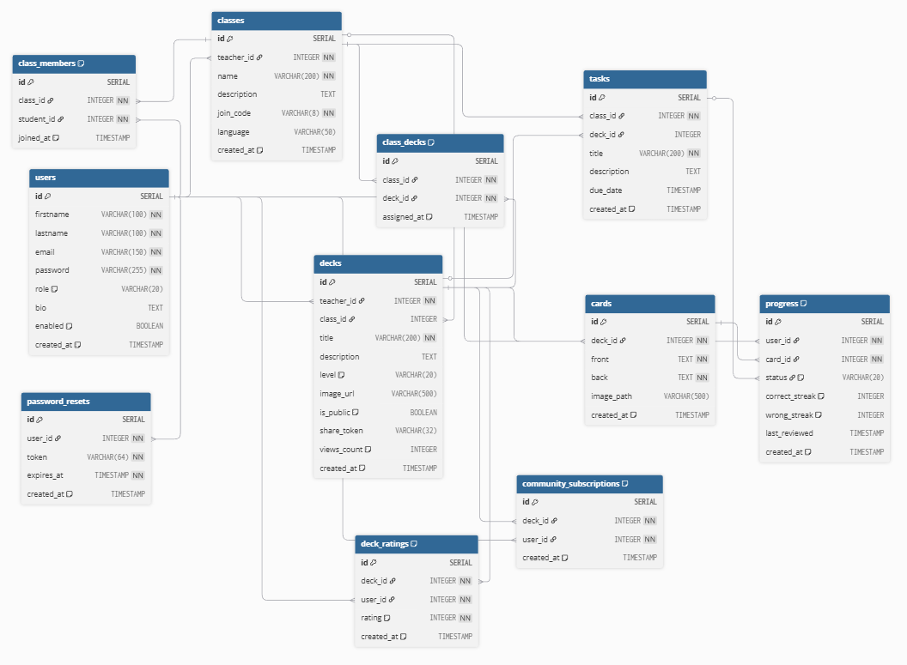

# MemoRise - Platforma do nauki fiszek

**MemoRise** to platforma edukacyjna do nauki przy użyciu fiszek (flashcards), zaprojektowana dla nauczycieli i uczniów. System umożliwia tworzenie klas, zarządzanie zestawami fiszek, śledzenie postępów w nauce oraz udostępnianie materiałów w społeczności.

---

## 🎯 Główne funkcjonalności

### Dla uczniów:
- Dołączanie do klas za pomocą kodu zaproszenia
- Nauka fiszek z wykorzystaniem systemu powtórek
- Śledzenie postępów nauki w czasie rzeczywistym
- Przeglądanie publicznych zestawów w społeczności
- Subskrybowanie i ocenianie zestawów
- Statystyki nauki z podziałem na zestawy

### Dla nauczycieli:
- Tworzenie i zarządzanie klasami
- Generowanie kodów zaproszeniowych dla klas
- Tworzenie własnych zestawów fiszek z obrazkami
- Przypisywanie zestawów do wielu klas jednocześnie
- Zarządzanie członkami klas
- Tworzenie zadań dla uczniów
- Udostępnianie zestawów publicznie w społeczności
- Panel zarządzania zestawami (edycja, usuwanie, publikacja)

### Społeczność:
- Przeglądanie publicznych zestawów innych nauczycieli
- Filtrowanie zestawów według języka i poziomu
- System ocen i wyświetleń zestawów
- Subskrypcje ulubionych zestawów
- Udostępnianie linków do zestawów

### Dla administratorów:
- Zarządzanie użytkownikami (zmiana ról, blokowanie)
- Przeglądanie wszystkich klas i użytkowników
- Panel administracyjny z statystykami

---

## Technologie

### Backend:
- **PHP 8.3** 
- **PostgreSQL** - baza danych
- **Nginx** - serwer HTTP
- **Docker** - konteneryzacja

### Frontend:
- **HTML5, CSS3** - struktura i stylizacja
- **JavaScript** - logika aplikacji

### Architektura:
- **MVC** (Model-View-Controller)
- **REST API** - komunikacja frontend-backend

---

## 📁 Struktura projektu

```
flashcards/
├── config.php                  # Konfiguracja bazy danych i SMTP
├── index.php                   # Punkt wejścia aplikacji
├── routing.php                 # Routing HTTP i API
├── Database.php                # Singleton połączenia z bazą danych
├── docker-compose.yaml         # Konfiguracja Docker Compose
│
├── docker/                     # Pliki Docker
│   ├── db/                     # PostgreSQL
│   │   ├── Dockerfile
│   │   ├── init.sql           # Schemat bazy + dane testowe
│   │   └── migrations/        # Migracje bazy danych
│   ├── nginx/                 # Nginx
│   │   ├── Dockerfile
│   │   └── nginx.conf
│   └── php/                   # PHP-FPM
│       └── Dockerfile
│
├── src/
│   ├── controllers/           # Kontrolery (logika biznesowa)
│   │   ├── SecurityController.php      # Logowanie, rejestracja
│   │   ├── DashboardController.php     # Widoki HTML
│   │   ├── AuthApiController.php       # API uwierzytelniania
│   │   ├── ClassApiController.php      # API klas
│   │   ├── DeckApiController.php       # API zestawów
│   │   ├── StudyApiController.php      # API nauki i progresu
│   │   ├── CommunityApiController.php  # API społeczności
│   │   └── AdminApiController.php      # API administratora
│   │
│   ├── model/                 # Modele danych
│   │   ├── User.php
│   │   ├── SchoolClass.php
│   │   ├── Deck.php
│   │   ├── Card.php
│   │   ├── Progress.php
│   │   └── Task.php
│   │
│   └── repository/            # Repozytoria (dostęp do bazy)
│       ├── UserRepository.php
│       ├── ClassRepository.php
│       ├── DeckRepository.php
│       ├── ProgressRepository.php
│       └── TaskRepository.php
│
└── public/                    # Publiczne zasoby
    ├── images/                # Obrazki
    │   ├── cards/            # Obrazki fiszek
    │   ├── decks/            # Obrazki zestawów
    │   └── flags/            # Flagi językowe
    │
    ├── scripts/              # JavaScript
    │   ├── main.js          # Inicjalizacja aplikacji
    │   ├── auth.js          # Logowanie, rejestracja
    │   ├── classes.js       # Zarządzanie klasami
    │   ├── teacher.js       # Panel nauczyciela
    │   ├── study.js         # System nauki fiszek
    │   ├── progress.js      # Statystyki postępów
    │   ├── community.js     # Społeczność
    │   ├── admin.js         # Panel administratora
    │   ├── account.js       # Ustawienia konta
    │   ├── shared.js        # Współdzielone funkcje
    │   └── api.js           # Klient API
    │
    ├── styles/              # CSS
    │   ├── main.css         # Główne style
    │   ├── login.css        # Style logowania
    │   ├── study.css        # Style nauki
    │   └── progress.css     # Style statystyk
    │
    └── views/               # Widoki HTML
        ├── login.html
        ├── register.html
        ├── dashboard.html
        ├── class_view.html
        ├── teacher_dashboard.html
        ├── teacher_panel.html
        ├── study.html
        ├── progress.html
        ├── community.html
        ├── account.html
        ├── admin_panel.html
        └── ...
```

---


###  Testowanie
-  **http://localhost:8080/login**

---

## 👥 Konta testowe

| Email | Hasło | Rola |
|-------|-------|------|
| jan.kowalski@example.com | Password123 | **Student** |
| anna.nowak@example.com | Password123 | **Nauczyciel** |
| admin@memorise.pl | Password123 | **Admin** |

**Kod klasy testowej:** `ABC12345` (Klasa 4a - niemiecki)

---

## 📊 Baza danych

### Schemat bazy:

**Główne tabele:**
- `users` - użytkownicy (studenci, nauczyciele, admini)
- `classes` - klasy utworzone przez nauczycieli
- `class_members` - relacja studenci ↔ klasy
- `decks` - zestawy fiszek (należą do nauczycieli)
- `class_decks` - przypisania zestawów do klas
- `cards` - fiszki (front/back)
- `progress` - progres nauki użytkowników
- `tasks` - zadania dla uczniów
- `deck_ratings` - oceny zestawów
- `community_subscriptions` - subskrypcje publicznych zestawów
- `password_resets` - tokeny resetowania hasła

### Dostęp do pgAdmin:
- URL: **http://localhost:5050**
- Email: `admin@example.com`
- Hasło: `admin`

**Dane połączenia z bazą:**
- Host: `db`
- Port: `5432`
- Database: `db`
- Username: `docker`
- Password: `docker`

---

## 🎮 Jak korzystać z aplikacji

### Jako uczeń:
1. Zarejestruj się lub zaloguj jako `jan.kowalski@example.com`
2. Kliknij **"Dołącz do klasy"** i wpisz kod: `ABC12345`
3. Wybierz klasę, następnie zestaw fiszek
4. Kliknij **"Rozpocznij naukę"**
5. Używaj klawiatury:
   - **Spacja** - odwróć fiszkę
   - **←** (strzałka w lewo) - nie znam
   - **→** (strzałka w prawo) - znam
6. Sprawdź swój progres w zakładce **"Postępy"**

### Jako nauczyciel:
1. Zaloguj się jako `anna.nowak@example.com`
2. Kliknij **"Panel nauczyciela"**
3. Utwórz klasę i pobierz kod zaproszenia
4. Stwórz zestaw fiszek:
   - Dodaj tytuł, opis, poziom trudności
   - Opcjonalnie dodaj obrazek zestawu
   - Dodaj fiszki (przód/tył)
5. Przypisz zestaw do wybranych klas
6. Opcjonalnie opublikuj zestaw w społeczności

### Jako admin:
1. Zaloguj się jako `admin@memorise.pl`
2. Kliknij **"Panel admina"**
3. Zarządzaj użytkownikami: zmieniaj role, blokuj konta
4. Przeglądaj wszystkie klasy i użytkowników

---

## 🔑 API Endpoints

### Uwierzytelnianie:
- `POST /api/auth/login` - logowanie
- `POST /api/auth/register` - rejestracja
- `POST /api/auth/logout` - wylogowanie
- `GET /api/auth/me` - dane zalogowanego użytkownika
- `PUT /api/auth/password` - zmiana hasła
- `POST /api/auth/forgot-password` - resetowanie hasła
- `POST /api/auth/reset-password` - potwierdzenie resetowania

### Klasy:
- `GET /api/classes` - lista klas użytkownika
- `GET /api/classes/{id}` - szczegóły klasy
- `POST /api/classes` - utworzenie klasy (nauczyciel)
- `PUT /api/classes/{id}` - edycja klasy (nauczyciel)
- `DELETE /api/classes/{id}` - usunięcie klasy (nauczyciel)
- `POST /api/classes/join` - dołączenie do klasy kodem
- `GET /api/classes/{id}/members` - członkowie klasy
- `DELETE /api/classes/{id}/members/{userId}` - usunięcie członka

### Zestawy fiszek:
- `GET /api/teacher/decks` - zestawy nauczyciela
- `POST /api/teacher/decks` - utworzenie zestawu
- `PUT /api/decks/{id}` - edycja zestawu
- `DELETE /api/decks/{id}` - usunięcie zestawu
- `GET /api/decks/{id}` - szczegóły zestawu
- `GET /api/decks/{id}/cards` - fiszki w zestawie
- `POST /api/decks/{id}/assign-classes` - przypisanie do klas
- `POST /api/upload/deck-image` - upload obrazka zestawu

### Nauka:
- `GET /api/study/next?deckId={id}` - następna fiszka
- `POST /api/progress/answer` - zapisanie odpowiedzi
- `GET /api/progress/stats` - statystyki ogólne
- `GET /api/progress/deck/{id}` - progres dla zestawu
- `POST /api/progress/reset/{id}` - reset progresu

### Społeczność:
- `GET /api/community/decks` - publiczne zestawy
- `GET /api/community/subscribed` - subskrybowane zestawy
- `GET /api/community/deck/{id}` - szczegóły publicznego zestawu
- `POST /api/community/deck/{id}/subscribe` - subskrypcja
- `DELETE /api/community/deck/{id}/unsubscribe` - anulowanie subskrypcji
- `POST /api/community/deck/{id}/rate` - ocena zestawu

### Admin:
- `GET /api/admin/users` - wszyscy użytkownicy
- `GET /api/admin/classes` - wszystkie klasy
- `PUT /api/admin/users/{id}/role` - zmiana roli użytkownika
- `PUT /api/admin/users/{id}/status` - blokowanie/odblokowywanie

---


 